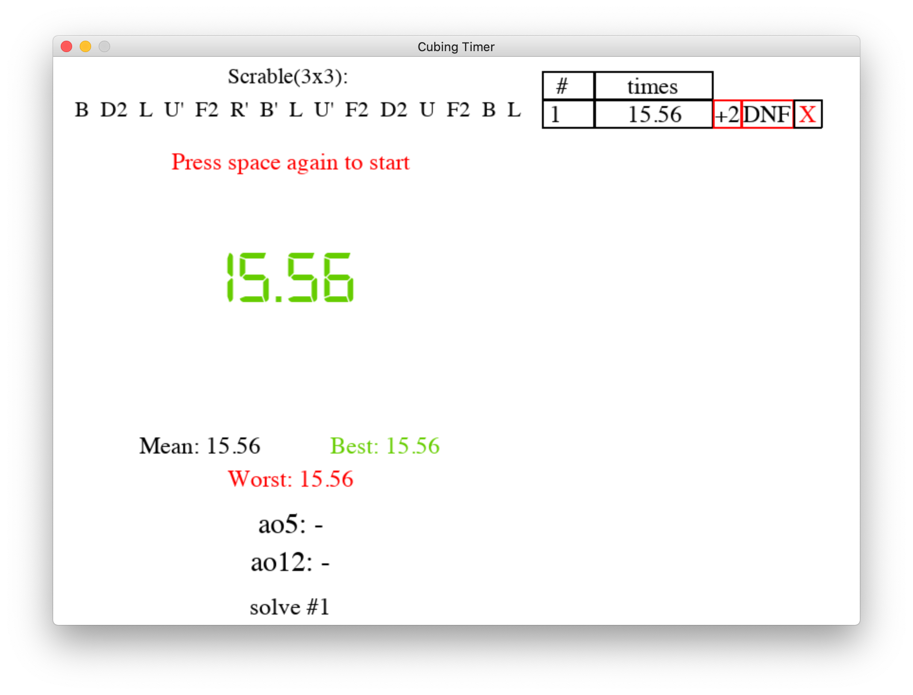

# A cubing timer made with pygame library

If you haven't download the pygame library

python2:

    pip install pygame

python3:

    pip3 install pygame

--------------------------------------------------------------------------------

Run cubing_timer.py to start the timer

# Current version only support 2 by 2 and 3 by 3 #

It will ask you "Which cube?(ex: 3 => 3x3):"

have fun cubing!

# Example images

View:

Timing:

When pressing space to start:

Author: John
